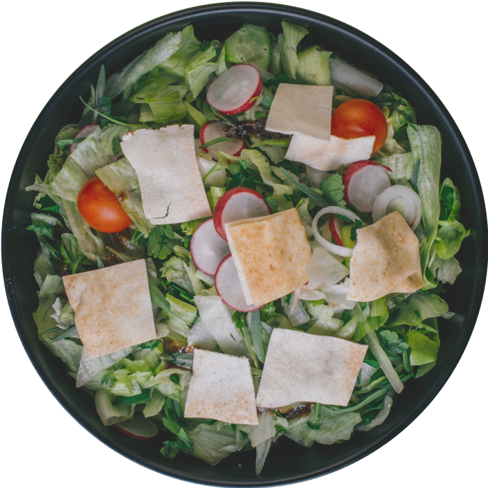

<a name="readme-top"></a>
[![Forks][forks-shield]][forks-url]
[![Stargazers][stars-shield]][stars-url]
[![Issues][issues-shield]][issues-url]
[![MIT License][license-shield]][license-url]

<br />
<div align="center">
  <a style="text-decoration: none" href="https://github.com/gabrielStertz/foodexplorer-front-end">
    
  </a>

  <h3 align="center">Food Explorer</h3>

  <p align="center">
    Project Stage "Desafio Final" - Program Explorer - Rocketseat
    <br />
    <br />
    <br />
    <a href="https://github.com/othneildrew/Best-README-Template">View Demo</a>
    ·
    <a href="https://github.com/gabrielStertz/foodexplorer-front-end/issues">Report Bug</a>
    ·
    <a href="https://github.com/gabrielStertz/foodexplorer-front-end/issues">Request Feature</a>
  </p>
</div>


<details>
  <summary>Table of Contents</summary>
  <ol>
    <li>
      <a href="#about-the-project">About The Project</a>
      <ul>
        <li><a href="#built-with">Built With</a></li>
      </ul>
    </li>
    <li>
      <a href="#getting-started">Getting Started</a>
      <ul>
        <li><a href="#prerequisites">Prerequisites</a></li>
        <li><a href="#installation">Installation</a></li>
        <li><a href="#running-the-back-end-server-for-this-project">Running the Back End (server) for this project</a></li>
        <li><a href="#admin-account">Admin account</a></li>
      </ul>
    </li>
    <li>
      <a href="#roadmap">Roadmap</a>
      <ul>
        <li><a href="#all-users">All users</a></li>
        <li><a href="#user-admin">User Admin</a></li>
      </ul>
   </li>
    <li><a href="#license">License</a></li>
    <li><a href="#author">Author</a></li>
    <li><a href="#acknowledgments">Acknowledgments</a></li>
  </ol>
</details>


## About the Project

This project is for the final stage of the program **Explorer** of the [Rocketseat](https://rocketseat.com.br) platform, where we learned how to create Front and Back end, using Javascript, React and others development tools.

<p align="right">(<a href="#readme-top">back to top</a>)</p>


## Built With

This are the technologies used in these project:

- [](https://nodejs.org/en/)
- [](https://vitejs.dev/)
- [](https://pt-br.reactjs.org/)
- [](https://axios-http.com/ptbr/docs/intro)

<p align="right">(<a href="#readme-top">back to top</a>)</p>


## Getting Started

### Prerequisites

Before we start, you will need to have installed this:
[Git](https://git-scm.com), [Node.js](https://nodejs.org/en/).
And is good to have an editor to work with de code [VSCode](https://code.visualstudio.com/)

<p align="right">(<a href="#readme-top">back to top</a>)</p>

### Installation

```bash
# Clone this repository
$ git clone <https://github.com/gabrielStertz/foodExplorer-front-end.git>

# Access the folder of the project in terminal/cmd
$ cd foodExplorer-front-end

# Install dependencies
$ npm install

# Run the application in development environment
$ npm run dev

# Access the browser in localhost:5173 - <http://localhost:5173>
```

<p align="right">(<a href="#readme-top">back to top</a>)</p>

### Running the Back End (server) for this project

#### The Back End of this project con be found in: [Food Explorer Back End](https://github.com/gabrielStertz/foodExplorer-front-end)

```bash
# Clone this repository
$ git clone <https://github.com/gabrielStertz/foodExplorer-back-end.git>

# Access the folder of the project in terminal/cmd
$ cd foodExplorer-back-end

# Install dependencies
$ npm install

# Run the migrations to create the database
$ npm run migrate

# Run the application in development environment
$ npm run dev

# the server will run in localhost:3333
```
#### The last command will create an User Admin:

<p align="right">(<a href="#readme-top">back to top</a>)</p>


## Admin account

>
> ### **e-mail:** gabriel@gmail.com
>
> ### **password:** 123
>

<p align="right">(<a href="#readme-top">back to top</a>)</p>


## Roadmap

### All users

- [x] Users
  - [x] Register of users
- [x] Favorites
  - [x] Mark favorites
- [x] Orders
  - [x] Add to orders
  - [x] Confirm orders
  - [x] Choose payment
  - [x] Accompany orders

### User Admin

- [ ] Users
  - [x] Register of users
  - [ ] Manage users
   - [ ] Add Admin
- [x] Menu  
  - [x] Register menu items
  - [x] Update menu items
  - [x] Delete menu items
- [x] Orders  
  - [x] Update status of orders

<p align="right">(<a href="#readme-top">back to top</a>)</p>


## License

Distributed under the MIT License. See [LICENSE.txt](https://github.com/gabrielStertz/foodexplorer-front-end/blob/main/LICENSE.txt) for more information.

<p align="right">(<a href="#readme-top">back to top</a>)</p>


## Author
---


 #### **Gabriel Stertz** 🚀

Feito com ❤️ por Gabriel Stertz 👋🏽 Entre em contato!

[](https://github.com/gabrielStertz) [](https://www.linkedin.com/in/gabrielstertz/) 
[](mailto:gabrielstertz2012@gmail.com)

<p align="right">(<a href="#readme-top">back to top</a>)</p>


## Acknowledgments

I would like to acknowledge the help of the following:

* [othneildrew/Best-README-Template](https://github.com/othneildrew/Best-README-Template)
* [MDN Web Docs](https://developer.mozilla.org/pt-BR/)
* [Google Fonts](https://fonts.google.com)
* [React Icons](https://react-icons.github.io/react-icons/search)
* [Visual Studio Code](https://code.visualstudio.com/)

<p align="right">(<a href="#readme-top">back to top</a>)</p>

[forks-shield]: https://img.shields.io/github/forks/gabrielStertz/foodexplorer-front-end.svg?style=for-the-badge
[forks-url]: https://github.com/gabrielStertz/foodexplorer-front-end/network/members
[stars-shield]: https://img.shields.io/github/stars/gabrielStertz/foodexplorer-front-end.svg?style=for-the-badge
[stars-url]: https://github.com/gabrielStertz/foodexplorer-front-end/stargazers
[issues-shield]: https://img.shields.io/github/issues/gabrielStertz/foodexplorer-front-end.svg?style=for-the-badge
[issues-url]: https://github.com/gabrielStertz/foodexplorer-front-end/issues
[license-shield]: https://img.shields.io/github/license/gabrielStertz/foodexplorer-front-end.svg?style=for-the-badge
[license-url]: https://github.com/gabrielStertz/foodexplorer-front-end/blob/main/LICENSE.txt